# VitePress 搭建博客系统指南

由于大环境不好，被 N+1 了，上班的路上还想着如何优化解决开发中遇到的痛点，开了一个早会，然后公司解散了，又要重新开始找工作了。由于之前工作比较忙，一直没有时间学习，趁着空档期好好的学习一波，顺便迁移一下自己的博客，老博客是 3 年前用 `hexo` 做的，最近看 `vitePress` 比较火，`VitePress` 是由 Vue 团队开发的轻量级静态站点生成器，专注于为文档和博客提供支持。它基于 Vite 和 Vue 3，具有快速构建速度和简单的配置特性，主题简洁明了易上手，所以就选用 [vitePress](<[vitePress](https://vitepress.dev/zh/guide/what-is-vitepress)>) 来搭建此次的博客系统。

## 一、前置要求

在开始之前，请确保你的环境满足以下要求：

- Node.js 版本 >= 16.x
- pnpm 或 Yarn, npm 包管理工具，推荐使用 `pnpm`

## 二、初始化

### 1. 创建项目目录

首先，选择一个合适的位置创建你的项目目录，以`pnpm` 为例，初始化 `package.json`

```bash
$ mkdir vitepress-blog && cd vitepress-blog && pnpm init
```

### 2. 安装 VitePress 生成项目

利用下面命令安装`vitePress`, 安装完成后，利用 VitePress 附带一个命令行设置向导，帮助我们快速构建一个基本项目。

::: code-group

```sh [pnpm]
$ pnpm add -D vitepress
#通过运行以下命令启动向导
$ pnpm vitepress init
```

```sh [npm]
$ npm add -D vitepress
#通过运行以下命令启动向导
$ npx vitepress init
```

```sh [yarn]
$ yarn add -D vitepress
#通过运行以下命令启动向导
$ yarn vitepress init
```

:::

配置我们需要的选项：

###

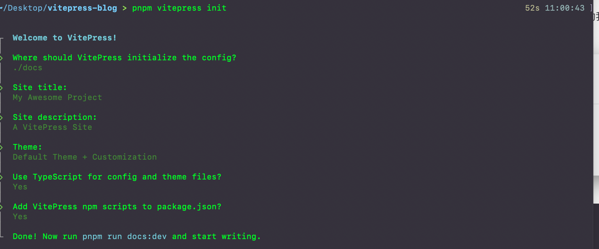

如果正在构建一个独立的 VitePress 站点，可以在当前目录 (`./`) 中搭建站点。但是，如果在现有项目中与其他源代码一起安装 VitePress，建议将站点搭建在嵌套目录 (例如 `./docs`) 中，以便它与项目的其余部分分开。

假设选择在 `./docs` 中搭建 VitePress 项目，生成的文件结构应该是这样的：

```
.
├── docs
│   ├── .vitepress
│   │   ├── config.mts
│   │   └── theme
│   │       ├── index.ts
│   │       └── style.css
│   ├── api-examples.md
│   ├── index.md
│   └── markdown-examples.md
├── node_modules
├── package.json
└── pnpm-lock.yaml
```

## 三、修改项目默认配置

### 1. 修改构建命令

打开`package.json`, 修改`scripts`下的命令，方便开发。添加`"type:":"module"`避免后面安装插件报错。

::: warning
在 package.json 文件中，添加 "type": "module" 是为了告诉 Node.js 使用 ECMAScript Modules (ESM) 语法来处理 .js 文件，而不是使用 CommonJS 模块系统
:::

```json{6,8-10}
{
  "name": "vitepress-blog",
  "version": "1.0.0",
  "description": "",
  "main": "index.js",
  "type":"module",
  "scripts": {
    "dev": "vitepress dev docs",
    "build": "vitepress build docs",
    "preview": "vitepress preview docs"
  },
  "keywords": [],
  "author": "",
  "license": "ISC",
  "dependencies": {
    "vitepress": "^1.3.4",
    "vue": "^3.4.38"
  }
}
```

### 2. 修改 vitePress 配置

打开`docs/.vitepress/config.mts`文件，添加如下配置，在`/docs`下创建`public`目录,用来存放静态资源，如网站的`favicon.ico`。在`themeConfig`的`search`字段设置搜索框配置，这里使用`local`, 可以使用`algolia`,其他配置参见[siteConfig](https://vitepress.dev/reference/site-config) 和 [themeConfig](https://vitepress.dev/zh/reference/default-theme-config)

```ts{9,10-42,60}
import { defineConfig } from "vitepress";

export default defineConfig({
  title: "My Awesome Project",
  description: "A VitePress Site",
  // header标签里面插入的内容
  head: [["link", { rel: "icon", href: "/favicon.ico" }]],
  themeConfig: {
    // 网站的logo
    logo: "/logo.svg",
    // 文章右侧大纲目录
    outline: {
      level: [2, 6],
      label: "目录",
    },
    //自定义上下页名
    docFooter: {
      prev: "上一页",
      next: "下一页",
    },

    // 主题
    darkModeSwitchLabel: "深浅模式",
    // 返回顶部label
    returnToTopLabel: "返回顶部",
    // 搜索
    search: {
      provider: "local",
    },
    // 页脚
    footer: {
      message: "Released under the MIT License.",
      copyright: "Copyright © 2023-present China Carlos",
    },
    // 文档的最后更新时间
    lastUpdated: {
    text: "Updated at",
    formatOptions: {
        dateStyle: "full",
        timeStyle: "medium",
      },
    },
    nav: [
      { text: "Home", link: "/" },
      { text: "Examples", link: "/markdown-examples" },
    ],

    sidebar: [
      {
        text: "Examples",
        items: [
          { text: "Markdown Examples", link: "/markdown-examples" },
          { text: "Runtime API Examples", link: "/api-examples" },
        ],
      },
    ],
    // 社交链接
    socialLinks: [{ icon: "github", link: "https://github.com/ChinaCarlos" }],
    // 部署的时候需要注意该参数避免样式丢失
    base: "/vitepress-blog-template/",
  },
});
```

### 3. 修改 vitePress 默认的主题样式

打开`.vitepress/theme/style.css` 文件，修改主题的颜色，如果想找配色可以去这个[www.eggradients.com](https://www.eggradients.com/)网站查找配色，然后替换`style.cs` 里面的颜色变量，例如下面一份简单的颜色配置：

```css
:root {
  --vp-c-brand-1: #5e3af2;
  --vp-c-brand-2: #694aea;
  --vp-c-brand-3: #7759f1;
}

.dark {
  --vp-c-brand-1: #9b85f5;
  --vp-c-brand-2: #7759f1;
  --vp-c-brand-3: #615ced;
}

:root {
  /* hero标题渐变色 */
  --vp-home-hero-name-color: transparent;
  --vp-home-hero-name-background: -webkit-linear-gradient(
    120deg,
    #5e3af2,
    #00f6c0
  );

  /*hero logo背景渐变色 */
  --vp-home-hero-image-background-image: linear-gradient(
    -45deg,
    #5f3af2c8 50%,
    #47cbff7e 50%
  );
  --vp-home-hero-image-filter: blur(76px);
}
```

运行`pnpm run dev`，打开浏览器，发现默认的颜色主题已经更改了

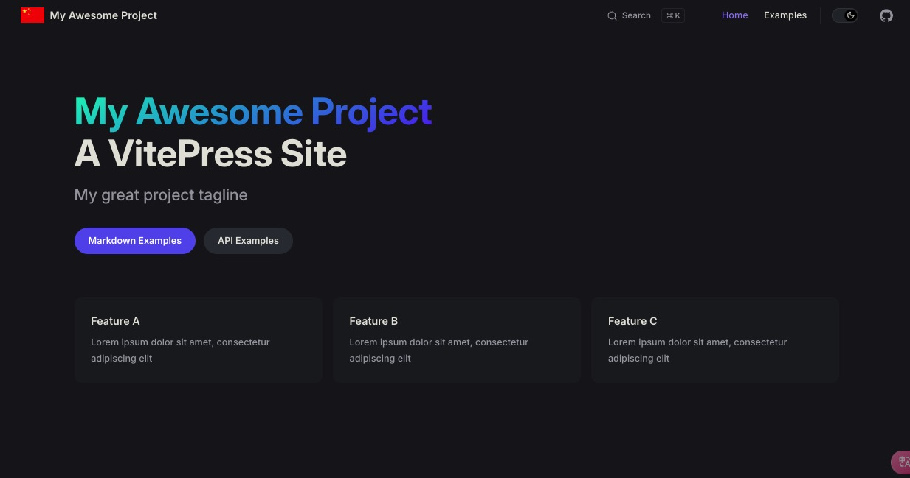

### 4. 修改首页

修改`/docs/index.md` 文件，修改`首页`展示的内容，总体分为三层`layout`,`hero`,`features`

- `layout` 首页的布局，首页默认是`home`
- `hero` 首页上方的展示区域配置
- `features` 首页下方区域的卡片配置

这里我提供一份简单的配置：

> 对应的图片需要自己放到`public`目录下

```markdown
---
layout: home

hero:
  name: "China Carlos's Blog"
  text: "PWA FAST SDK"
  tagline: Carlos's Blog Web Site
  image:
    src: /pwa.svg
    alt: VitePress
  actions:
    - theme: brand
      text: FAST PWA SDK API
      link: https://carlosme.fun
    - theme: alt
      text: PWA 应用案例
      link: https://carlosme.fun
    - theme: alt
      text: 我的博客
      link: https://carlosme.fun
    - theme: alt
      text: 前端面经
      link: https://carlosme.fun
    - theme: alt
      text: 支持一下
      link: https://carlosme.fun

features:
  - title: 什么是PWA渐进式应用？
    icon:
      src: /light_pwa.svg
    details: PWA（Progressive Web Application，渐进式 Web 应用）是一种结合了传统 Web 应用与原生移动应用优势的应用程序。PWA 利用现代 Web 技术提供用户体验接近原生应用的 Web 应用
    link: https://carlosme.fun
    linkText: 查看详情
  - title: PWA 是如何构建的？
    icon:
      src: /config.svg
    details: 构建一个 PWA（渐进式 Web 应用）涉及多个关键技术和步骤，以确保应用具备离线能力、快速加载、可安装性等核心特性。以下是构建 PWA 的主要步骤和技术。
    link: https://carlosme.fun
    linkText: 查看详情
  - title: PWA 应用的优势有哪些？
    icon:
      src: /lightning.svg
    details: PWA 结合了 Web 应用的普遍可用性和原生应用的用户体验，是一种低成本、高效能的跨平台应用开发解决方案，通过提供离线能力、推送通知、可安装性等特性，能够在保持用户体验的同时，降低开发、维护和分发成本。
    link: https://carlosme.fun
    linkText: 查看详情
  - title: 如何快速开发一个PWA应用？
    icon:
      src: /terminal.svg
    details: 要快速开发一个 PWA 应用，可以遵循以下步骤。这些步骤涵盖了从设置基础项目到实现 PWA 核心特性的所有内容。
    link: https://carlosme.fun
    linkText: 查看详情
  - title: PWA 的使用场景有哪些？
    icon:
      src: /mode.svg
    details: PWA 的应用场景非常广泛，其核心优势包括离线支持、跨平台兼容、安装便捷性等，使其适用于各种类型的应用和服务。无论是商业、教育、医疗还是娱乐领域，PWA 都能够提供流畅、高效和可靠的用户体验。
    link: https://carlosme.fun
    linkText: 查看详情
  - title: PWA 周边生态
    icon:
      src: /earth.svg
    details: PWA（渐进式Web应用）生态包括Service Workers、Web App Manifest、响应式设计、离线支持、推送通知和应用缓存等技术，旨在提升Web应用的性能和用户体验，接近原生应用的功能。
    link: https://carlosme.fun
    linkText: 查看详情
---
```

此时首页的内容发生了更改：如下图所示：
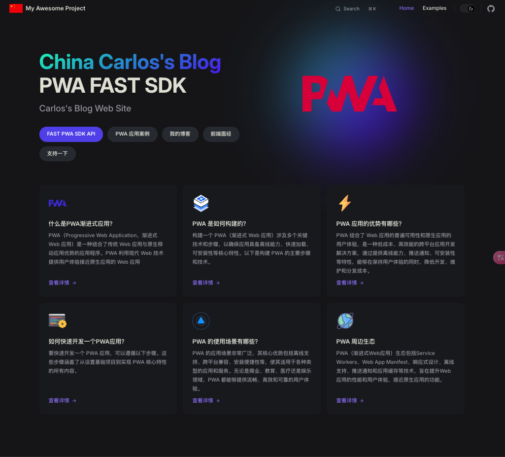

## 四、打包部署

### 1. 在 github 中创建一个名称为`vitepress-blog`的仓库，当然仓库的名字可以自定义

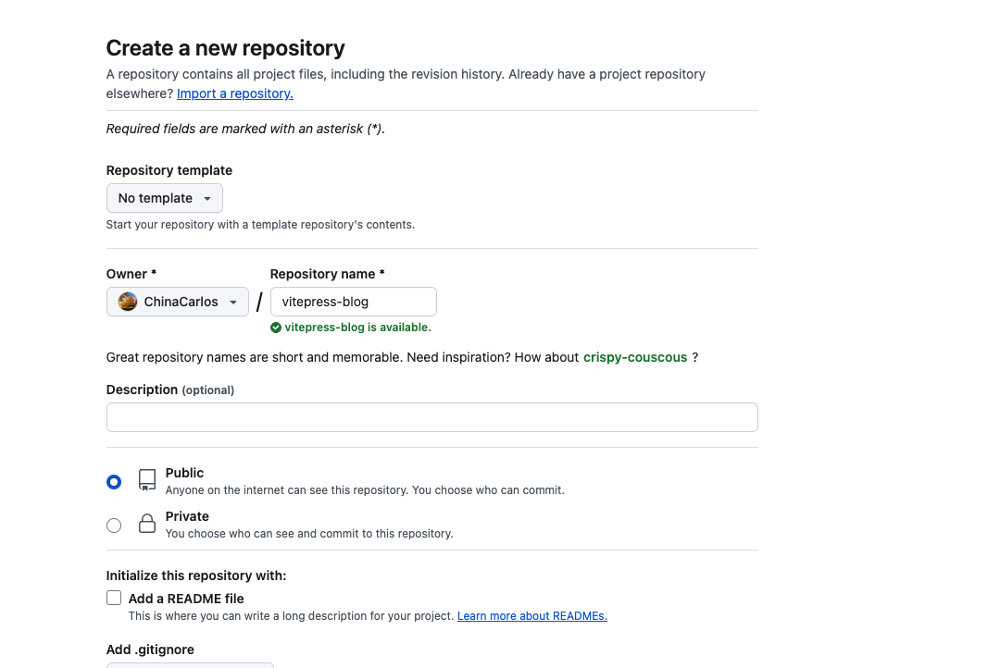

### 2. 在项目中初始化 git

```bash
$ git init
```

### 3. 根目录添加`.gitignore` 文件

> 忽略一下不需要提交到 github 的文件以及目录

```.gitignore
node_modules
dist
cache
.temp
.DS_Store
```

### 4. 上传代码

```bash
git branch -M main
git add .
git commit -m "init project"
# 关联远程仓库 git@github.com:userName/repositoryName.git 这里是你自己的仓库地址
git remote add origin git@github.com:userName/repositoryName.git
git push -u origin main
```

### 5. 通过 github actions 部署到 github pages

:::tip
基本都使用 github pages 来部署博客系统，使用 github pages 有两种方式，一种是通过分支部署，通常要写一个`deploy.sh`,在提交代码之后执行该脚本，将打包之后的产物放到另一个分支上，通过 github pages `Deploy from a branch` 方式部署，另一种通过`github actions`来部署。这里展示利用`github actions` 来部署，更加快捷，每次提交完代码自动构建部署。
:::
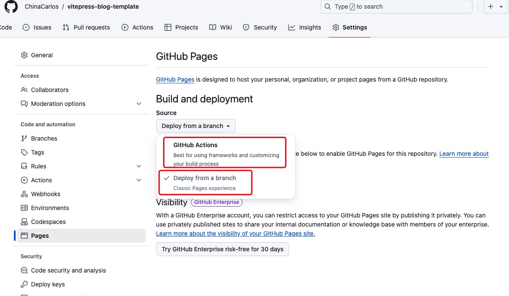

如上图所示，我们在 github`vitepress-blog`仓库的`Settings`里面，找到`Pages`, 部署方式选择`Github Actions`,下面编写 github 的`workflows`。

执行下面命令创建`.github/workflows` 目录 和生成该目录下的`deploy.yml` 文件

```bash
$ mkdir .github
$ mkdir .github/workflows/
$ touch .github/workflows/deploy.yml
```

**修改`deploy.yml`文件，内容如下：**

```yaml
# 构建 VitePress 站点并将其部署到 GitHub Pages 的示例工作流程
name: Deploy VitePress site to Pages

on:
  # 在针对 `main` 分支的推送上运行
  # 如果是使用 `master` 分支作为默认分支，请将其更改为 `master`
  push:
    branches: [main]

  # 允许你从 Actions 选项卡手动运行此工作流程
  workflow_dispatch:

# 设置 GITHUB_TOKEN 的权限，以允许部署到 GitHub Pages
permissions:
  contents: read
  pages: write
  id-token: write

# 只允许同时进行一次部署，跳过正在运行和最新队列之间的运行队列
# 但是，不要取消正在进行的运行，因为我们希望允许这些生产部署完成
concurrency:
  group: pages
  cancel-in-progress: false

jobs:
  # 构建工作
  build:
    runs-on: ubuntu-latest
    steps:
      - name: Checkout
        uses: actions/checkout@v4
        with:
          fetch-depth: 0 # 如果未启用 lastUpdated，则不需要
      - uses: pnpm/action-setup@v3 # 使用 pnpm
      - name: Setup Node
        uses: actions/setup-node@v4
        with:
          node-version: 20
          cache: pnpm # 缓存设置为 pnpm
          version: 8.14.0 # 您可以根据需要指定特定的 pnpm 版本
      - name: Setup Pages
        uses: actions/configure-pages@v4
      - name: Install dependencies
        run: pnpm install # 使用 pnpm 安装依赖
      - name: Build with VitePress
        run: pnpm run build # 使用 pnpm 运行构建
      - name: Upload artifact
        uses: actions/upload-pages-artifact@v3
        with:
          path: docs/.vitepress/dist # 打包之后产物的文件夹

  # 部署工作
  deploy:
    environment:
      name: github-pages
      url: ${{ steps.deployment.outputs.page_url }}
    needs: build
    runs-on: ubuntu-latest
    name: Deploy
    steps:
      - name: Deploy to GitHub Pages
        id: deployment
        uses: actions/deploy-pages@v4
```

然后提交代码到 github，此时就会自动触发 github actions

::: danger
github actions 如果报错：Error: No pnpm version is specified. Please specify it by one of the following ways

请在`package.json`中添加` "packageManager": "pnpm@8.14.0"`
:::

**Github Actions 位置**：

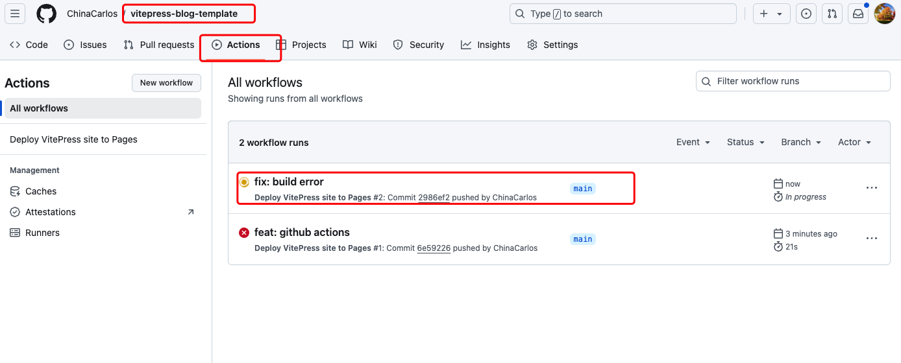

**Github Actions 构建部署**：

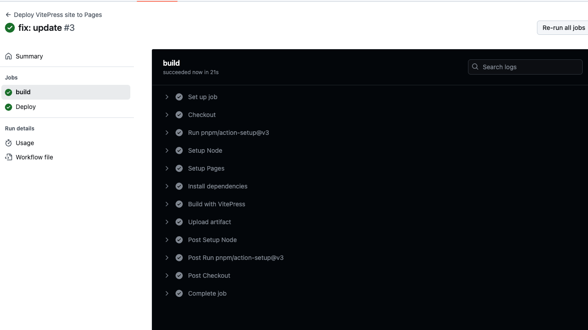
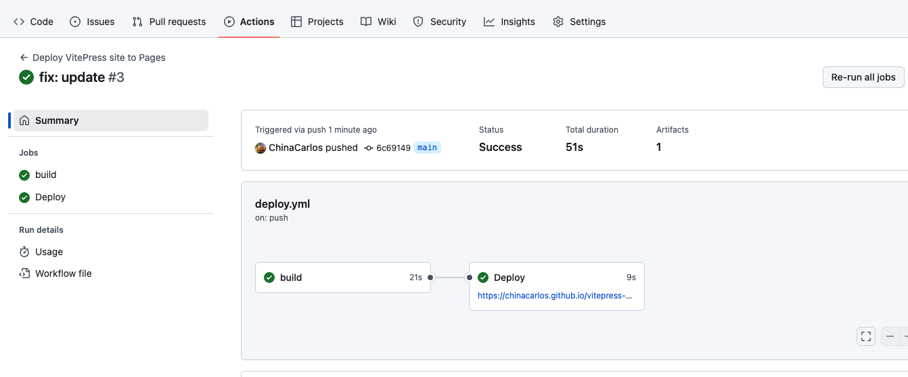

**Github Actions 部署完成之后，访问 Github Pages 的链接，即可访问博客系统**：

例如： [https://chinacarlos.github.io/vitepress-blog-template/](https://chinacarlos.github.io/vitepress-blog-template/)

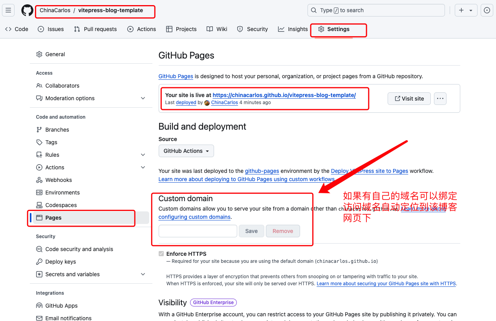

**如果有自己的博客域名，可以将博客域名绑定到`Custom domain` 下，绑定之后，访问该域名会自动跳转定位到该博客系统**

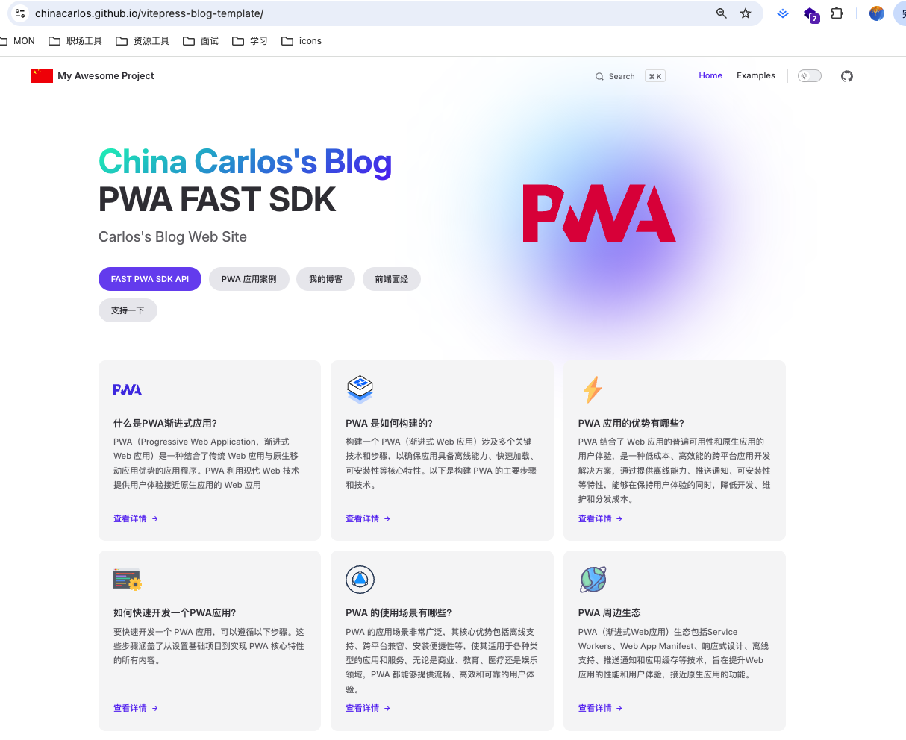

::: warning

- 如果发现博客的样式丢失，此时要检查`docs/.vitepress/config.mts`文件夹下的`base` 设置是否正确。
- 如果使用 Github Pages 自己的链接访问如：`https://chinacarlos.github.io/vitepress-blog-template/` `base`需要设置成 `/vitepress-blog-template/` 也就是自己的博客仓库名称

- 如果自己绑定了自己的博客域名如`https://carlosme.fun`, `base`需要设置为`/`

:::

---

**至此，我们博客整体框架已经完成了，接下就是美化以及丰富博客的功能模块了 🎉🎉🎉**

## 五、美化主题

### 1. 更改搜索框的位置，修改代码块，给导航栏添加毛玻璃等效果，如下图：


修改`.vitepress/theme/style.css`文件：

::: code-group

```css [.vitepress/theme/style.css]
:root {
  --vp-c-brand-1: #5e3af2;
  --vp-c-brand-2: #694aea;
  --vp-c-brand-3: #7759f1;

  --vp-custom-block-info: #cccccc;
  --vp-custom-block-info-bg: #fdfdfe;

  --vp-custom-block-tip: #009400;
  --vp-custom-block-tip-bg: #e6f6e6;

  --vp-custom-block-warning: #e6a700;
  --vp-custom-block-warning-bg: #fff8e6;

  --vp-custom-block-danger: #e13238;
  --vp-custom-block-danger-bg: #ffebec;

  --vp-custom-block-note: #4cb3d4;
  --vp-custom-block-note-bg: #eef9fd;

  --vp-custom-block-important: #a371f7;
  --vp-custom-block-important-bg: #f4eefe;
  /* hero标题渐变色 */
  --vp-home-hero-name-color: transparent;
  --vp-home-hero-name-background: -webkit-linear-gradient(
    120deg,
    #5e3af2,
    #00f6c0
  );

  /*hero logo背景渐变色 */
  --vp-home-hero-image-background-image: linear-gradient(
    -45deg,
    #5f3af2c8 50%,
    #47cbff7e 50%
  );
  --vp-home-hero-image-filter: blur(76px);
}

.dark {
  --vp-custom-block-info: #cccccc;
  --vp-custom-block-info-bg: #474748;

  --vp-custom-block-tip: #009400;
  --vp-custom-block-tip-bg: #003100;

  --vp-custom-block-warning: #e6a700;
  --vp-custom-block-warning-bg: #4d3800;

  --vp-custom-block-danger: #e13238;
  --vp-custom-block-danger-bg: #4b1113;

  --vp-custom-block-note: #4cb3d4;
  --vp-custom-block-note-bg: #193c47;

  --vp-custom-block-important: #a371f7;
  --vp-custom-block-important-bg: #230555;

  --vp-c-brand-1: #9b85f5;
  --vp-c-brand-2: #7759f1;
  --vp-c-brand-3: #615ced;
}

/* 标题字体大小 */
.custom-block-title {
  font-size: 16px;
}

/* 注释容器:背景色、左侧 */
.custom-block.info {
  background-color: var(--vp-custom-block-info-bg);
  border-left: 5px solid var(--vp-custom-block-info);
}

/* 提示容器:边框色、背景色、左侧 */
.custom-block.tip {
  /* border-color: var(--vp-custom-block-tip); */
  background-color: var(--vp-custom-block-tip-bg);
  border-left: 5px solid var(--vp-custom-block-tip);
}

/* 警告容器:背景色、左侧 */
.custom-block.warning {
  background-color: var(--vp-custom-block-warning-bg);
  border-left: 5px solid var(--vp-custom-block-warning);
}

/* 危险容器:背景色、左侧 */
.custom-block.danger {
  background-color: var(--vp-custom-block-danger-bg);
  border-left: 5px solid var(--vp-custom-block-danger);
}

/* NOTE容器:背景色、左侧 */
.custom-block.note {
  background-color: var(--vp-custom-block-note-bg);
  border-left: 5px solid var(--vp-custom-block-note);
}

/* IMPORTANT容器:背景色、左侧 */
.custom-block.important {
  background-color: var(--vp-custom-block-important-bg);
  border-left: 5px solid var(--vp-custom-block-important);
}

/* CAUTION容器:背景色、左侧 */
.custom-block.caution {
  background-color: var(--vp-c-red-soft);
  border-left: 5px solid var(--vp-c-red-3);
}

/* 侧边栏 */
.group:has([role="button"]) .VPSidebarItem.level-0 .items {
  padding-left: 16px !important;
  border-radius: 2px;
  transition: background-color 0.25s;
}

/* 搜索框的位置 */
.VPNavBarSearch.search {
  justify-content: flex-end !important;
  padding-right: 32px !important;
}

.vp-doc blockquote {
  border-left: 4px solid var(--vp-c-divider);
}

/* .vitepress/theme/style/blur.css */
:root {
  /* 首页导航 */
  .VPNavBar {
    background-color: rgba(255, 255, 255, 0);
    backdrop-filter: blur(10px);
  }

  /* 文档页导航两侧 */
  .VPNavBar:not(.home) {
    background-color: rgba(255, 255, 255, 0);
    backdrop-filter: blur(10px);
  }

  @media (min-width: 960px) {
    /* 文档页导航两侧 */
    .VPNavBar:not(.home) {
      background-color: rgba(255, 255, 255, 0);
      backdrop-filter: blur(10px);
    }

    /* 首页下滑后导航两侧 */
    .VPNavBar:not(.has-sidebar):not(.home.top) {
      background-color: rgba(255, 255, 255, 0);
      backdrop-filter: blur(10px);
    }
  }

  @media (min-width: 960px) {
    /* 文档页导航中间 */
    .VPNavBar:not(.home.top) .content-body {
      background-color: rgba(255, 255, 255, 0);
      backdrop-filter: blur(10px);
    }

    /* 首页下滑后导航中间 */
    .VPNavBar:not(.has-sidebar):not(.home.top) .content-body {
      background-color: rgba(255, 255, 255, 0);
      backdrop-filter: blur(10px);
    }
  }

  /* 分割线 */

  @media (min-width: 960px) {
    /* 文档页分割线 */
    .VPNavBar:not(.home.top) .divider-line {
      background-color: rgba(255, 255, 255, 0);
      backdrop-filter: blur(10px);
    }

    /* 首页分割线 */
    .VPNavBar:not(.has-sidebar):not(.home.top) .divider {
      background-color: rgba(255, 255, 255, 0);
      backdrop-filter: blur(10px);
    }
  }

  /* 搜索框 VPNavBarSearchButton.vue */
  .DocSearch-Button {
    background-color: rgba(255, 255, 255, 0);
    backdrop-filter: blur(10px);
  }

  /* 移动端大纲栏 */
  .VPLocalNav {
    background-color: rgba(255, 255, 255, 0);
    backdrop-filter: blur(10px);
    /* 隐藏分割线 */
    /* border-bottom: 5px solid var(--vp-c-gutter); */
    border-bottom: 0px;
  }
}

/* .vitepress/theme/style/vp-code-group.css */

/* 代码块tab */
.vp-code-group .tabs {
  padding-top: 30px;
}

/* 代码块tab-顶部小圆点 */
.vp-code-group .tabs::before {
  background: #fc625d;
  border-radius: 50%;
  box-shadow: 20px 0 #fdbc40, 40px 0 #35cd4b;
  content: " ";
  height: 12px;
  width: 12px;
  left: 12px;
  margin-top: -15px;
  position: absolute;
}

/* 代码组 */
.vp-code-group {
  color: var(--vp-c-black-soft);
  border-radius: 8px;
  box-shadow: 0 10px 30px 0 rgb(0 0 0 / 40%);
}
```

:::

## 六、丰富功能模块（插件篇）

> 为了扩展 vitepress 的功能社区提供了很多插件供我门选择， 根据我们的需求自行选择对应的插件

### 1. 添加评论插件

使用`giscus`来做`vitepress` 的评论模块，使用也非常的简单，具体可以参考：[giscus 文档](https://giscus.app/zh-CN)，首先安装`giscus`

::: code-group

```sh [pnpm]
$ pnpm add -D @giscus/vue

```

```sh [npm]
$ npm install -D @giscus/vue

```

:::

打开[giscus 文档](https://giscus.app/zh-CN)，如下图所示，填入你的 github `用户名 + 仓库名`，勾选你需要的配置

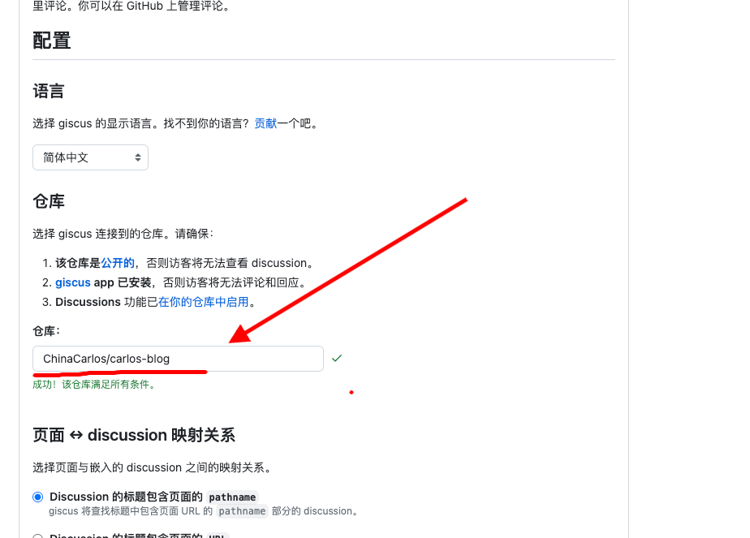

**记住你的这几个参数 `repo`, `repo-id`, `category`, `category-id`**, 后面添加评论组件需要用到

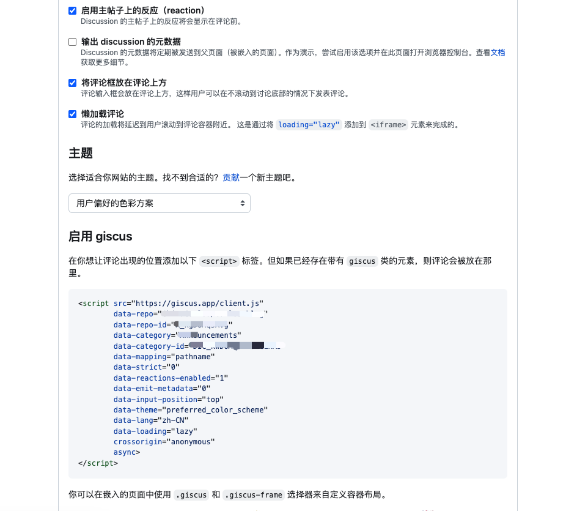

在`.vitepress/theme/`目录下创建`Layout.vue`组件，添加 giscus 评论组件，在`.vitepress/config.mts`配置文件中使用自定义布局。

::: code-group

```vue [Layout.vue]
<template>
  <Layout>
    <template #doc-footer-before> </template>
    <template #doc-after>
      <div style="margin-top: 24px">
        <Giscus
          :key="page.filePath"
          repo="*"
          repo-id="*"
          category="*"
          category-id="*"
          mapping="pathname"
          strict="0"
          reactions-enabled="1"
          emit-metadata="0"
          input-position="bottom"
          lang="zh-CN"
          crossorigin="anonymous"
          :theme="isDark ? 'dark' : 'light'"
        />
      </div>
    </template>
  </Layout>
</template>

<script lang="ts" setup>
import Giscus from "@giscus/vue";
import DefaultTheme from "vitepress/theme";
import { watch } from "vue";
import { inBrowser, useData } from "vitepress";

const { isDark, page } = useData();

const { Layout } = DefaultTheme;

watch(isDark, (dark) => {
  if (!inBrowser) return;

  const iframe = document
    .querySelector("giscus-widget")
    ?.shadowRoot?.querySelector("iframe");

  iframe?.contentWindow?.postMessage(
    { giscus: { setConfig: { theme: dark ? "dark" : "light" } } },
    "https://giscus.app"
  );
});
</script>
```

```ts [.vitepress/config.mts]
...
import Layout from "./Layout.vue";
...

export default {
  ...
  Layout: () => {
    return h(Layout, null, {
      // https://vitepress.dev/guide/extending-default-theme#layout-slots
    });
  }
  ...
  }
```

:::

添加之后效果如下：
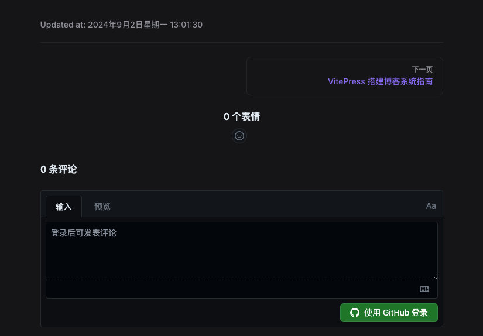

---

### 2. 首页添加`五彩纸屑`插件

::: code-group

```sh [pnpm]
$ pnpm add canvas-confetti
```

:::

创建组件`.vitepress/theme/components/confetti.vue`,在首页`index.md`中引入，需要在`.vitepress/theme/index.ts`注入该 Vue 组件
::: code-group

```vue [.vitepress/theme/components/confetti.vue]
<script setup lang="ts">
import confetti from "canvas-confetti";
import { inBrowser } from "vitepress";

if (inBrowser) {
  /* 纸屑 */
  confetti({
    particleCount: 100,
    spread: 170,
    origin: { y: 0.6 },
  });
}
</script>
```

```ts [.vitepress/theme/index.ts]
...
import confetti from "./components/confetti.vue";
...
  enhanceApp(ctx) {
    const { app } = ctx;
    app.component("confetti", confetti);
  },
...

```

```markdown [index.md]
<!-- 添加到md文章末尾 -->
<confetti />
```

:::

添加之后的首页效果图：


### 3. 首页添加`访客统计`插件 `busuanzi`

::: code-group

```sh [pnpm]
$ pnpm add busuanzi.pure.js
```

:::

::: code-group

```ts [.vitepress/theme/index.ts]
...
import busuanzi from "busuanzi.pure.js";

import VisitorPanel from "./components/VisitorPanel.vue";

...
  enhanceApp(ctx) {
    const { app, router, siteData } = ctx;
...
    app.component("VisitorPanel", VisitorPanel);
    if (inBrowser) {
      router.onAfterRouteChanged = () => {
        busuanzi.fetch();
      };
    }
  },


```

```vue [.vitepress/theme/components/VisitorPanel.vue]
<template>
  <div class="panel">
    <div class="container">
      <section class="grid">
        <span class="text">
          本站总访问量
          <span id="busuanzi_value_site_pv" class="font-bold">--</span> 次
        </span>
        
        <span class="text">
          本站访客数
          <span id="busuanzi_value_site_uv" class="font-bold">--</span> 人次
        </span>
      </section>
    </div>
  </div>
</template>

<script setup lang="ts">
import { inBrowser } from "vitepress";
const onLinkUmiHandle = () => {
  if (inBrowser) {
    window.open(
      "https://us.umami.is/share/Y2BYxCAm7R0DG2Xi/carlosme.fun",
      "_blank"
    );
  }
};
</script>

<style scoped>
.panel {
  margin-top: 12px;
  margin-bottom: 8px;
}

.container {
  background-color: var(--vp-c-bg-soft);
  border-radius: 8px;
  width: 100%;
  min-height: 32px;
  max-width: 1152px;
  margin-left: auto;
  margin-right: auto;
}

.heart-img {
  border-radius: 4px;
  cursor: pointer;
}

.grid {
  font-weight: 500;
  padding-top: 12px;
  padding-bottom: 12px;
  padding-left: 12px;
  padding-right: 12px;
  justify-items: center;
  align-items: center;
  grid-template-columns: repeat(3, minmax(0, 1fr));
  display: grid;
}

.text {
  font-size: 0.875rem;
  line-height: 1.25rem;
}
</style>
```

```markdown [index.md]
<!-- 添加到md文章末尾 -->
<VisitorPanel />
```

:::

安装完之后效果图：

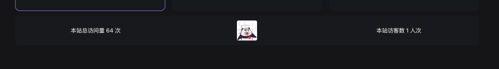

### 4. 其他实用插件

::: tip
其他的插件我就不一一列举了，无脑参考对应的文档安装就可以了
:::

- sandpack 插件，实时编码 `itepress-plugin-sandpack` https://vitepress-sandbox.js-bridge.com/

  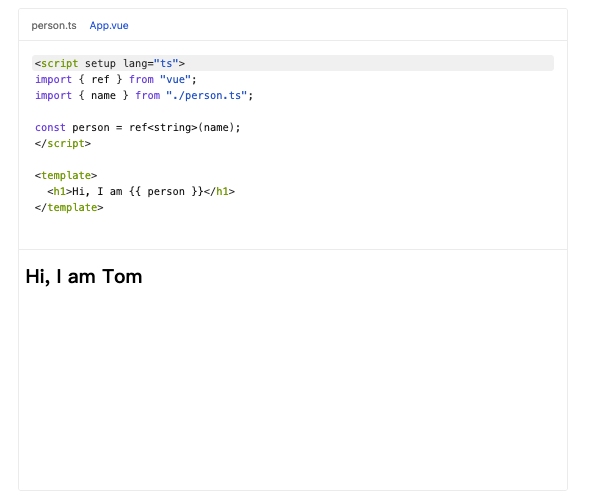

- Vue 组件预览插件 `@vitepress-code-preview` https://welives.github.io/vitepress-code-preview/
  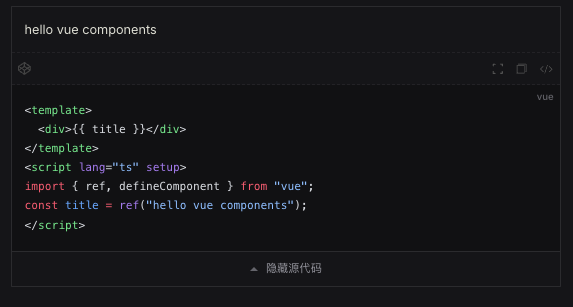

- 根据目录自定生成侧边栏插件 `vitepress-sidebar` https://vitepress-sidebar.cdget.com/

- 页面加载进度插件 `vitepress-plugin-nprogress` https://github.com/ZhongxuYang/vitepress-plugin-nprogress

- 文件图标插件 `vitepress-plugin-group-icons` https://vp.yuy1n.io/
  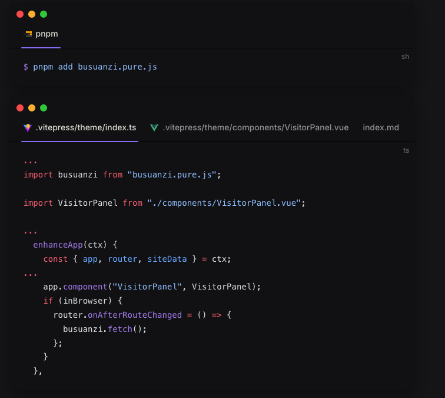

- 博客访问流量统计分析工具 `https://umami.is/`

  > 例如：https://us.umami.is/share/Y2BYxCAm7R0DG2Xi/carlosme.fun

- 图片放大查看 `medium-zoom` https://github.com/vuejs/vitepress/issues/854

在 `.vitepress/theme/index.ts` 添加如下代码，并保存

::: code-group

```ts [.vitepress/theme/index.ts]
import DefaultTheme from "vitepress/theme";
import mediumZoom from "medium-zoom";
import { onMounted, watch, nextTick } from "vue";
import { useRoute } from "vitepress";

export default {
  extends: DefaultTheme,

  setup() {
    const route = useRoute();
    const initZoom = () => {
      // mediumZoom('[data-zoomable]', { background: 'var(--vp-c-bg)' }); // 默认
      mediumZoom(".main img", { background: "var(--vp-c-bg)" }); // 不显式添加{data-zoomable}的情况下为所有图像启用此功能
    };
    onMounted(() => {
      initZoom();
    });
    watch(
      () => route.path,
      () => nextTick(() => initZoom())
    );
  },
};
```

```css [.vitepress/theme/style.css]
/* 重置样式 */
.medium-zoom-overlay {
  z-index: 30;
}

.medium-zoom-image {
  z-index: 9999 !important;
}
```

:::
