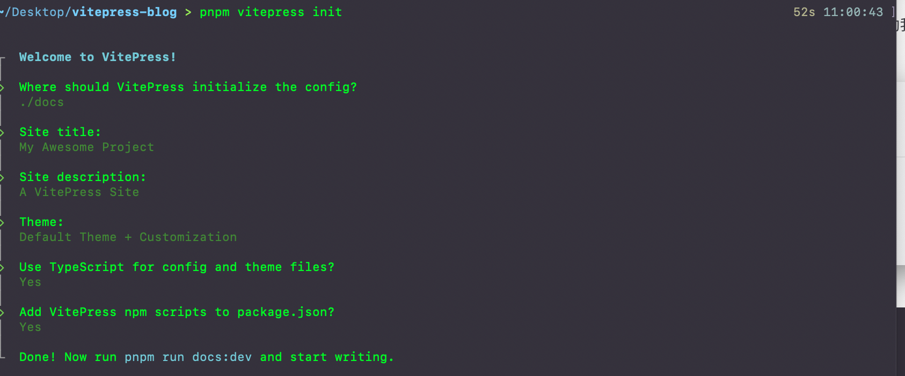
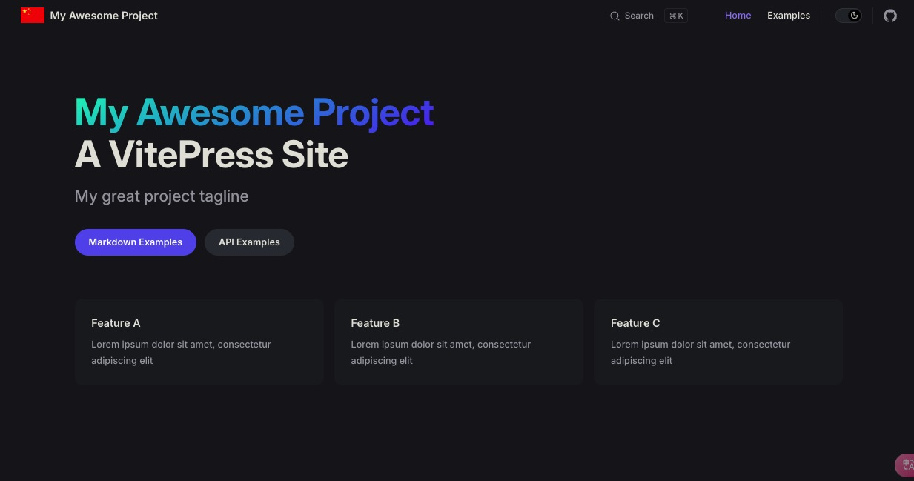
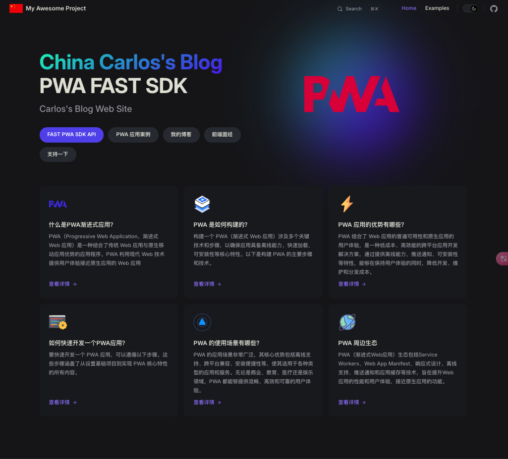
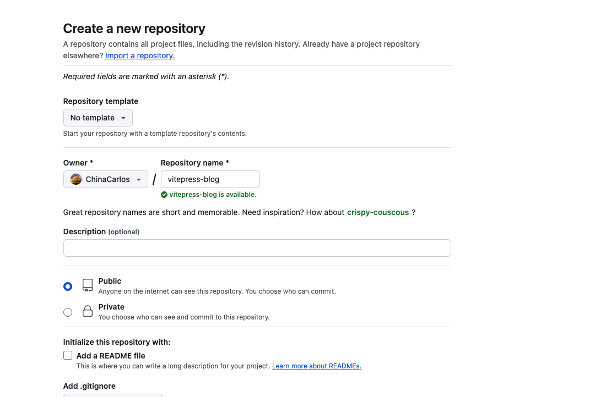

# VitePress 搭建博客系统指南（上篇）

由于大环境不好，被 N+1 了，上班的路上还想着如何优化解决开发中遇到的痛点，开了一个早会，然后公司解散了，又要重新开始找工作了。由于之前工作比较忙，一直没有时间学习，趁着空档期好好的学习一波，顺便迁移一下自己的博客，老博客是 3 年前用 `hexo` 做的，最近看 `vitePress` 比较火，`VitePress` 是由 Vue 团队开发的轻量级静态站点生成器，专注于为文档和博客提供支持。它基于 Vite 和 Vue 3，具有快速构建速度和简单的配置特性，主题简洁明了易上手，所以就选用 [vitePress](<[vitePress](https://vitepress.dev/zh/guide/what-is-vitepress)>) 来搭建此次的博客系统。

## 一、前置要求

在开始之前，请确保你的环境满足以下要求：

- Node.js 版本 >= 16.x
- pnpm 或 Yarn, npm 包管理工具，推荐使用 `pnpm`

## 二、初始化

### 1. 创建项目目录

首先，选择一个合适的位置创建你的项目目录，以`pnpm` 为例，初始化 `package.json`

```bash
$ mkdir vitepress-blog && cd vitepress-blog && pnpm init
```

### 2. 安装 VitePress 生成项目

利用下面命令安装`vitePress`, 安装完成后，利用 VitePress 附带一个命令行设置向导，帮助我们快速构建一个基本项目。

::: code-group

```sh [pnpm]
$ pnpm add -D vitepress
#通过运行以下命令启动向导
$ pnpm vitepress init
```

```sh [npm]
$ npm add -D vitepress
#通过运行以下命令启动向导
$ npx vitepress init
```

```sh [yarn]
$ yarn add -D vitepress
#通过运行以下命令启动向导
$ yarn vitepress init
```

:::

配置我们需要的选项：

###



如果正在构建一个独立的 VitePress 站点，可以在当前目录 (`./`) 中搭建站点。但是，如果在现有项目中与其他源代码一起安装 VitePress，建议将站点搭建在嵌套目录 (例如 `./docs`) 中，以便它与项目的其余部分分开。

假设选择在 `./docs` 中搭建 VitePress 项目，生成的文件结构应该是这样的：

```
.
├── docs
│   ├── .vitepress
│   │   ├── config.mts
│   │   └── theme
│   │       ├── index.ts
│   │       └── style.css
│   ├── api-examples.md
│   ├── index.md
│   └── markdown-examples.md
├── node_modules
├── package.json
└── pnpm-lock.yaml
```

## 三、修改项目默认配置

### 1. 修改构建命令

打开`package.json`, 修改`scripts`下的命令，方便开发。添加`"type:":"module"`避免后面安装插件报错。

::: warning
在 package.json 文件中，添加 "type": "module" 是为了告诉 Node.js 使用 ECMAScript Modules (ESM) 语法来处理 .js 文件，而不是使用 CommonJS 模块系统
:::

```json{6,8-10}
{
  "name": "vitepress-blog",
  "version": "1.0.0",
  "description": "",
  "main": "index.js",
  "type":"module",
  "scripts": {
    "dev": "vitepress dev docs",
    "build": "vitepress build docs",
    "preview": "vitepress preview docs"
  },
  "keywords": [],
  "author": "",
  "license": "ISC",
  "dependencies": {
    "vitepress": "^1.3.4",
    "vue": "^3.4.38"
  }
}
```

### 2. 修改 vitePress 配置

打开`docs/.vitepress/config.mts`文件，添加如下配置，在`/docs`下创建`public`目录,用来存放静态资源，如网站的`favicon.ico`。在`themeConfig`的`search`字段设置搜索框配置，这里使用`local`, 可以使用`algolia`,其他配置参见[siteConfig](https://vitepress.dev/reference/site-config) 和 [themeConfig](https://vitepress.dev/zh/reference/default-theme-config)

```ts{9,10-42}
import { defineConfig } from "vitepress";

export default defineConfig({
  title: "My Awesome Project",
  description: "A VitePress Site",
  // header标签里面插入的内容
  head: [["link", { rel: "icon", href: "/favicon.ico" }]],
  themeConfig: {
    // 网站的logo
    logo: "/logo.svg",
    // 文章右侧大纲目录
    outline: {
      level: [2, 6],
      label: "目录",
    },
    //自定义上下页名
    docFooter: {
      prev: "上一页",
      next: "下一页",
    },

    // 主题
    darkModeSwitchLabel: "深浅模式",
    // 返回顶部label
    returnToTopLabel: "返回顶部",
    // 搜索
    search: {
      provider: "local",
    },
    // 页脚
    footer: {
      message: "Released under the MIT License.",
      copyright: "Copyright © 2023-present China Carlos",
    },
    // 文档的最后更新时间
    lastUpdated: {
    text: "Updated at",
    formatOptions: {
        dateStyle: "full",
        timeStyle: "medium",
      },
    },
    nav: [
      { text: "Home", link: "/" },
      { text: "Examples", link: "/markdown-examples" },
    ],

    sidebar: [
      {
        text: "Examples",
        items: [
          { text: "Markdown Examples", link: "/markdown-examples" },
          { text: "Runtime API Examples", link: "/api-examples" },
        ],
      },
    ],
    // 社交链接
    socialLinks: [{ icon: "github", link: "https://github.com/ChinaCarlos" }],
  },
});
```

### 3. 修改 vitePress 默认的主题样式

打开`.vitepress/theme/style.css` 文件，修改主题的颜色，如果想找配色可以去这个[www.eggradients.com](https://www.eggradients.com/)网站查找配色，然后替换`style.cs` 里面的颜色变量，例如下面一份简单的颜色配置：

```css
:root {
  --vp-c-brand-1: #5e3af2;
  --vp-c-brand-2: #694aea;
  --vp-c-brand-3: #7759f1;
}

.dark {
  --vp-c-brand-1: #9b85f5;
  --vp-c-brand-2: #7759f1;
  --vp-c-brand-3: #615ced;
}

:root {
  /* hero标题渐变色 */
  --vp-home-hero-name-color: transparent;
  --vp-home-hero-name-background: -webkit-linear-gradient(
    120deg,
    #5e3af2,
    #00f6c0
  );

  /*hero logo背景渐变色 */
  --vp-home-hero-image-background-image: linear-gradient(
    -45deg,
    #5f3af2c8 50%,
    #47cbff7e 50%
  );
  --vp-home-hero-image-filter: blur(76px);
}
```

运行`pnpm run dev`，打开浏览器，发现默认的颜色主题已经更改了



### 4. 修改首页

修改`/docs/index.md` 文件，修改`首页`展示的内容，总体分为三层`layout`,`hero`,`features`

- `layout` 首页的布局，首页默认是`home`
- `hero` 首页上方的展示区域配置
- `features` 首页下方区域的卡片配置

这里我提供一份简单的配置：

> 对应的图片需要自己放到`public`目录下

```markdown
---
layout: home

hero:
  name: "China Carlos's Blog"
  text: "PWA FAST SDK"
  tagline: Carlos's Blog Web Site
  image:
    src: /pwa.svg
    alt: VitePress
  actions:
    - theme: brand
      text: FAST PWA SDK API
      link: https://carlosme.fun
    - theme: alt
      text: PWA 应用案例
      link: https://carlosme.fun
    - theme: alt
      text: 我的博客
      link: https://carlosme.fun
    - theme: alt
      text: 前端面经
      link: https://carlosme.fun
    - theme: alt
      text: 支持一下
      link: https://carlosme.fun

features:
  - title: 什么是PWA渐进式应用？
    icon:
      src: /light_pwa.svg
    details: PWA（Progressive Web Application，渐进式 Web 应用）是一种结合了传统 Web 应用与原生移动应用优势的应用程序。PWA 利用现代 Web 技术提供用户体验接近原生应用的 Web 应用
    link: https://carlosme.fun
    linkText: 查看详情
  - title: PWA 是如何构建的？
    icon:
      src: /config.svg
    details: 构建一个 PWA（渐进式 Web 应用）涉及多个关键技术和步骤，以确保应用具备离线能力、快速加载、可安装性等核心特性。以下是构建 PWA 的主要步骤和技术。
    link: https://carlosme.fun
    linkText: 查看详情
  - title: PWA 应用的优势有哪些？
    icon:
      src: /lightning.svg
    details: PWA 结合了 Web 应用的普遍可用性和原生应用的用户体验，是一种低成本、高效能的跨平台应用开发解决方案，通过提供离线能力、推送通知、可安装性等特性，能够在保持用户体验的同时，降低开发、维护和分发成本。
    link: https://carlosme.fun
    linkText: 查看详情
  - title: 如何快速开发一个PWA应用？
    icon:
      src: /terminal.svg
    details: 要快速开发一个 PWA 应用，可以遵循以下步骤。这些步骤涵盖了从设置基础项目到实现 PWA 核心特性的所有内容。
    link: https://carlosme.fun
    linkText: 查看详情
  - title: PWA 的使用场景有哪些？
    icon:
      src: /mode.svg
    details: PWA 的应用场景非常广泛，其核心优势包括离线支持、跨平台兼容、安装便捷性等，使其适用于各种类型的应用和服务。无论是商业、教育、医疗还是娱乐领域，PWA 都能够提供流畅、高效和可靠的用户体验。
    link: https://carlosme.fun
    linkText: 查看详情
  - title: PWA 周边生态
    icon:
      src: /earth.svg
    details: PWA（渐进式Web应用）生态包括Service Workers、Web App Manifest、响应式设计、离线支持、推送通知和应用缓存等技术，旨在提升Web应用的性能和用户体验，接近原生应用的功能。
    link: https://carlosme.fun
    linkText: 查看详情
---
```

此时首页的内容发生了更改：如下图所示：


## 四、提交代码到 github

### 1. 在 github 中创建一个名称为`vitepress-blog`的仓库，当然仓库的名字可以自定义



### 2. 在项目中初始化 git

```bash
$ git init
```

### 3. 根目录添加`.gitignore` 文件

> 忽略一下不需要提交到 github 的文件以及目录

```.gitignore
node_modules
dist
cache
.temp
.DS_Store
```

### 4. 上传代码

```bash
git branch -M main
git add .
git commit -m "init project"
# 关联远程仓库 git@github.com:userName/repositoryName.git 这里是你自己的仓库地址
git remote add origin git@github.com:userName/repositoryName.git
git push -u origin main
```
